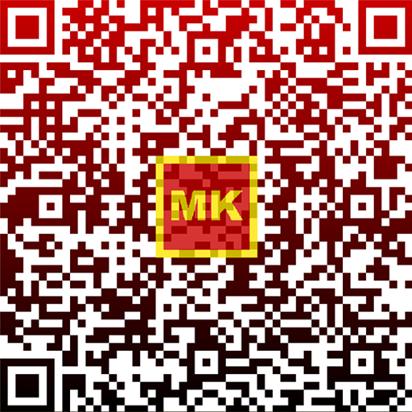
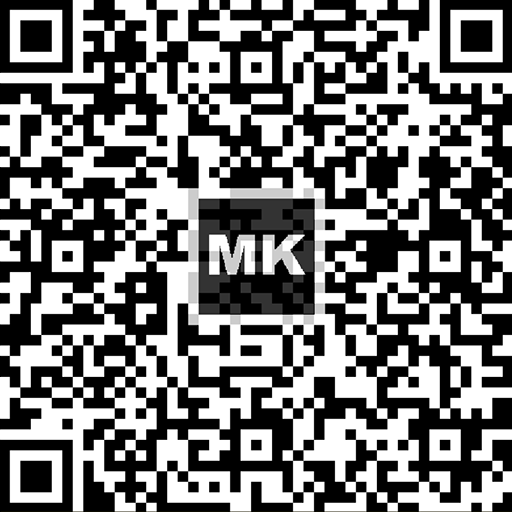

# MKQR предлог стандард

**MKQR** претставува Македонски **отворен** и **независен** предлог стандард за енкодирање и начин на пренос на податоци за финансиски трансакции, како што се на пример: плаќање на режии, плаќање на фактури, донации, и сл. 

Стандардот ја дефинира формата на податоците кои го опишуваат секој аспект на една трансакција. Податоците за една трансакција се дефинирани како обичен текст во MKQR формат кој го следи [URI стандардот](https://www.w3.org/Addressing/URL/uri-spec.html). Текстот визуелно се енкодира во стандардизиран MKQR (quick response) код базиран на QR стандардот ISO/IEC18004, кој потоа може да се испечати на хартија, прикаже на екран, итн. Кодот скениран од апликација на паметен телефон создава текстурална врска која ги содржи сите аспекти на една трансакција дефинирани со овој стандард. Апликациите кои го имплементираат овој стандард во целост, можат да извршуваат финансиски трансакции преку стандардизирани текстуални врски и нивните соодветни MKQR кодови.

## Предлагачи на стандардот

| Факултет за Информатички и Комуникациски Технологии ([ФИКТ](http://fikt.uklo.edu.mk)) - Битола| |
| :--: | |
|  | Во подготовка е формирање на непрофитен конзорциум на поддржувачи и имплементатори на стандардот кој ќе го води и обликува според потребите на сите вклучени страни.|

## Верзионирање

Стандардот e верзиониран семантички. Основната верзија е 1.0.0

# Дефиниции

Во овој сегмент се наоѓаат дефинициите на податоците кои опишуваат една трансакција и форматот на обичниот текст. 

## Поимник

| Поим | Опис |
| --- | --- |
| MKQR | Референца кон овој стандард. |
| MKQR URI | Обичен текст кој го следи URI стандардот. |
| Трансакција | Една трансакција која се опишува преку MKQR стандардот. |
| Клиент | Апликација која го имплементира MKQR стандардот. |
| Доверител | Приватен или правен субјект кој е дестинација на трансакцијата. |
| Должник | Приватен или правен субјект кој е извор на трансакцијата. |

## MKQR URI формат

Податоците за секоја трансакција се комбинираат во една инстанца на обичен текст во MKQR URI формат која апликациите кои го имплементираат станрадот можат да го анализираат. MKQR URI форматот започнува со фиксен сегмент:
	
	mkqr://pay?
	
Над овој сегмент се конкатанираат останатите податоци за една трансакција.

Сите апликации кои го користат MKQR URI формат мораат да регистрираат дека го препознаваат овој формат во оперативниот систем во кој се извршуваат.

## Валидација на податоците 

Сите задолжителни податоци и сите податоци кои ги содржи MKQR URI текстот мораат да бидат валидирани. Валидацијата се прави **пред** генерирање на MKQR кодот.  

Ако било кој од задолжителните податоци не може да биде валидиран, тогаш клиентот треба да прекине со генерирање на MKQR кодот. Ако било кој од незадолжителните податоци не може да биде валидиран, клиентот мора да го предупреди корисникот дека внесениот податок е невалиден.

MKQR не ја гарантира комплетната валидност на податоците бидејќи тие не можат да бидат комплетно валидирани пред генерирањето на MKQR кодот. На пример, дали сметката поврзана со некој IBAN постои, не може да биде гарантирано при генерирање на MKQR кодот. Клиентите можат да прават дополнителна валидација на податоците, според сопствените потреби.

## Изглед на QR кодот

MKQR кодот може да биде во боја или монохроматски. 

QR кодот кој е во боја има градиент кој почнува од горниот дел на QR кодот со црвена боја (#CC0708), а завршува во долниот дел на QR кодот со црна боја (#000000). Во центарот е логото на MKQR кодот. Логото на MKQR кодот има рамка со дебелина од 1 квадратче на сите 4 страни. Рамката е со жолта боја дефинирана на знамето на Република Македонија. Во центарот на логото се буквите МК, обоени со жолта боја дефинирана на знамето на Република Македонија, кои имаат вкупна ширина од 11 квадратчина и вкупна висина од 5 квадратчиња. Големината на логото е 13 квадратчиња во ширина и во висина. Позадината е со црвена боја како што е дефинирана на знамето на Република Македонија. Логото има 20% провидност.

Монохроматскиот код ги содржи само црната и белата боја. Димензиите на логото се исти како и димензиите на QR кодот во боја. Позадината на монохроматскиот код е црна, рамката и текстот се бели. Логото има 20% провидност.

Примери:

| Сметки | Донации | Уплатници (монохроматски) |
|-|-|-|
|  |  |  |

## Податоци на трансакцијата

| Име на атрибутот                  | Кратенка | Дефиниција                                             | Вредности                                                             | Забелешка                                                    | Тип на податок | Пример |
| --------------------------------- | -------- | ------------------------------------------------------------ | ------------------------------------------------------------ | ------------------------------------------------------------ | -------------- | --- |
| QRType                            | t        | Tип на стандардот.                 | **MKD**                   | **MKD** е фиксна вредност за MKQR.                                    | **Задолжителен**   | t=MKD |
| Version                           | v        | Верзија на спецификацијата според која MKQR кодот е генериран. | Фиксна должина, 4 цифри.                                     | Засега верзијата е 1.0.0, и ќе се користат само првите два елементи без точката со водечка нула до максимум две цифри.          | **Задолжителен**   | За верзија 1.0.0, v=0100  За верзија 1.2.4, v=0124  |
| Coding                            | c        | Tип на кодна страна на податоците во текстот.                | **1** за UTF-8 енкодирање но само со подмножество на латинични карактери. **2** за UTF-8 енкодирање со сите карактери вклучително и кирилица.                                     |  | **Задолжителен**   | c=0 или c=1|
| IBAN                              | iban     | IBAN на сметката на доверителот. | Комплексен податок, се валидира со изразот [[1]](?id=regex-израз-за-валидација-на-iban)                   |  Клиентите можат да имплементираат и дополнителни валидации на IBAN.                                                              | **Задолжителен**   | iban=MK00000000000000000000
| Alternative IBAN                  | aiban    | Алтернативни IBAN сметки на доверителот, одделени со pipe **\|** карактерот. | Максимум 77 карактери, секој поединечен внес се валидира со изразот [[1]](?id=regex-израз-за-валидација-на-iban)                                        | Алтернативните сметки се подредени по преференца на доверителот. | Незадолжителен       | aiban=MK00000000000000000000\|MK00000000000000000000\|MK00000000000000000000
| Address Type                      | cat      | Тип на адресата на доверителот. | **S** - структурирана адреса во повеќе полиња.  **K** - комбинирана адреса во две полиња.                      |                                                              | **Задолжителен**   | cat=S или cat=K
| Creditor Name                     | cn       | Име (и презиме) на доверителот. | Максимум 70 карактери.                                        |                                                              | **Задолжителен**   | cn=Стојан Стојановски  cn=Некоја Компанија ДООЕЛ
| Street or address line 1          | cadd1    | За структурирана адреса **S** се става името на улицата или поштенскиот код на доверителот.  За Комбинирана адреса **К** се става првата линија од адресата, улица и број или поштенски код. | **S** - максимум 16 карактери.  **К** - максимум 70 карактери.     | Ако cat=K, тогаш овој податок мора да постои. | Незадолжителен       | За **S**, cadd1=7110 За **K**, cadd1=Питу Гули 12
| Building number or address line 2 | cadd2    | За структурирана адреса **S** се става бројот на адресата на доверителот.  За Комбинирана адреса **K** се става втората линија од адресата: градот и поштенскиот број на доверителот. | **S** - максимум 16 карактери.  **К** - максимум 70 карактери.     |                                                              | Незадолжителен       | За **S**, cadd2=17/4   За **K**, cadd2=7000 Битола
| Postal Code                       | cz       | За структурирана адреса **S** се става поштенскиот број.        | **S** - максимум 7 карактери.  **К** - се изоставува.                | Ако cat=S (структурирана адреса), тогаш овој податок е задолжителен. | Условен       | cz=7110
| Town Name                         | cg       | Името на градот на доверителот.                                | **S** - максимум 35 карактери.  **K** - се изоставува.               | Ако cat=S (структурирана адреса), тогаш овој податок е задолжителен. | Условен       | cg=Битола
| Country                           | cc       | Држава на доверителот.                                         | Фиксна должина, 2 карактери, според стандардот ISO 3166-1.                    |                               | **Задолжителен**   | cc=MK
| Amount                            | а        | Сума на трансакцијата. | Децимален нумерички податок од 8 бајти, еквивалент на **double** како што е дефиниран во стандардот IEEE-754. | Сумата мора да е текст кој може да биде претворен во **double**. Ако сумата не може да биде претворена во овој формат генерирањето на MKQR треба да биде прекинато. | Незадолжителен       | a=3.33333333333333333333333333333333333333 
| Currency                          | cur      | Валута на плаќањето.                                                       | Фиксна должина, 3 карактери, според стандардот ISO 4217. | Дали валутата на плаќање е дозволена утврдува клиентот. Дали валутата е валидна се утврдува според присуството во [[5]](?id=Валутни-кодови) | **Задолжителен**   | cur=MKD
| Ultimate Debtor address type      | pat      | Типот на адреса на должникот. | **S** - структурирана адреса во повеќе полиња.  **K** - комбинирана адреса во две полиња.                    |  | Незадолжителен       | pat=S или pat=K
| Ultimate Debtor Name              | pn       | Име (и презиме) на должникот. | Максимум 70 карактери. |                                                              | Незадолжителен       |pn=Стојан Стојановски  pn=Некоја Компанија ДООЕЛ
| Street Name or Address Line 1     | padd1   | За структурирана адреса **S** се става името на улицата или поштенскиот код на должникот.  За Комбинирана адреса **К** се става првата линија од адресата, улица и број или поштенски код. | **S** - максимум 16 карактери. **К** - максимум 70 карактери.                                      |                                                              | Незадолжителен       | За **S**, padd1=7110 За **K**, padd1=Питу Гули 12
| Building Number or Address Line 2 | padd2   | За структурирана адреса **S** се става бројот на адресата на доверителот. За Комбинирана адреса **K** се става втората линија од адресата: градот и поштенскиот број на доверителот. | **S** - максимум 16 карактери. **К** - максимум 70 карактери.                                                              | | Незадолжителен       | За **S**, padd2=17/4 За **K**, padd2=7000 Битола
| Postal Code                       | pz       | За структурирана адреса **S** се става поштенскиот број.                   | **S** - максимум 7 карактери. **К** - се изоставува. | Ако pat=S (структурирана адреса), тогаш овој податок е задолжителен. | Условен | pz=7110
| Town Name                         | pn       | Името на градот на доверителот.                     | **S** - максимум 35 карактери. **K** - се изоставува. |Ако pat=S (структурирана адреса), тогаш овој податок е задолжителен.                                                              | Условен               | pn=Битола
| Country                           | pc       | Држава на доверителот.               | Фиксна должина, 2 карактери, според стандардот ISO 3166-1.              | Дали државниот код е валиден се утврдува според пристуството во [[4]](?id=Државни-кодови) | Незадолжителен                                                              | pc=MK 
| Payment Reference Type            | rt       | Тип на референца. Следните кодови се дозволени: QRR – QRR референца. SCOR – Референца на доверителот (ISO 11649) NON – без референца                                     | Најмногу 4 алфанумерички карактери. QRR (кога се користи QR-IBAN) или SCOR / NON (кога се користи IBAN) |                                                              | **Задолжителен**   | rt=QRR rt=SCOR
| Payment Reference                 | ref      | Референца. Структурираната референца е или QRR референца или ISO 11649 - Референца на доверителот. | Најмногу 27 алфанумерички карактери;    QRR референца: 27 нумерички карактери, калкулација на пресметковна сума според модул 10 рекурзивен, 27-ма позиција на референцата.     Референца на доверителот (ISO 11649): најмногу 25 карактери, алфанумерички.   Се игнорира ако е пополнет за rt=NON. | Задолжителен ако се користи QR-IBAN. | Условен | ref=111111111111111111111111111
| Payment Code                      | pcd       | Шифра на плаќање                  | 3 цифри                           | Описот на шифрите е достапен на [[3]](?id=Шифри-на-плаќање)                                                             | **Задолжителен**   | pcd=289
| Payment Type                      | nac      | Начин на плаќање          | 1 цифра                             |                                                              | Незадолжителен       | nac=1
| PP50 Uplatna smetka               | us50       | Трансакциска сметка на налогопримачот                                                              | Фиксна должина, 15 цифри                                                              |                                                              | Незадолжителен       | us50=210000000000000
| PP50 Smetka Edinka Korisnik       | usek50     | Трансакциска сметка на налогодавачот | Фиксна должина, 15 цифри                                                              |                                                               |Незадолжителен                | usek50=210000000000000
| PP30 Uplatna smetka               | us30       | Трансакциска сметка на налогопримачот                                                              | Фиксна должина, 15 цифри                                                              |                                                              | Незадолжителен       | us30=210000000000000
| PP30 Smetka Edinka Korisnik       | usek30     | Трансакциска сметка на налогодавачот | Фиксна должина, 15 цифри                                                              |                                                               |Незадолжителен                | usek30=210000000000000
| Additional info, USTRD            | i        | Дополнителни информации                                                             | Најмногу 140 алфанумерички карактери                                                               | [Документација](https://support.microsoft.com/en-us/topic/cumulative-sepa-credit-transfer-and-sepa-direct-debit-update-is-available-for-austria-direct-debit-specific-country-format-update-cor1-mandate-scheme-and-changes-in-mt940-file-import-format-functionality-in-microsoft-dynamics-ax-ea309e22-5247-1ead-9303-e0de4e5e56e8)                                                              |Незадолжителен                | i=Дополнителни информации
| CheckURL                          | curl     | Адреса за дополнителна валидација на внесените податоци. Одговорот мора да е HTTPS во JSON формат и мора да содржи еден атрибут "IsValid" кој дефинира дали валидацијата била успешна или не.                                                               | Комплексен податок, се валидира со изразот [[2]](?id=regex-израз-за-валидација-на-url)                                                              |                                                              |Незадолжителен                | curl=https://www.example.com/
| Alternative Payment Scheme        | ap       | Име на алтернативниот начин на плаќање.                                                             |  Најмногу 20 алфанумерички карактери                                                              |                                                              |Незадолжителен                | ap=SUPERMARKET KUPON
| Alternative Payment Values        | av       | Вредност на алтернативниот начин на плаќање.                                                             | Децимален нумерички податок од 8 бајти, еквивалент на **double** како што е дефиниран во стандардот IEEE-754.                                                              |                                                              |Незадолжителен                | av=100.0
| Alternative Payment Description   | ad       | Опис на алтернативниот начин на плаќање                                                              | Најмногу 240 алфанумерички карактери                                                              |                                                              |Незадолжителен                | ad=Опис на начинот на плаќање со купони во супермаркетот
| Alternative Payment Currency      | ac       | Валута на алтернативниот начин на плаќање. Може да биде изоставена.                                                              |Фиксна должина, 3 карактери, според стандардот ISO 4217.                                                                | Дали валутата на плаќање е дозволена утврдува клиентот. Дали валутата е валидна се утврдува според присуството во [[5]](?id=Валутни-кодови)                                                      |Незадолжителен                | 
---
# Прилог

## Regex израз за валидација на IBAN
	^([A-Z]{2}[ \\-]?[0-9]{2})(?=(?:[ \\-]?[A-Z0-9]){9,30}$)((?:[ \\-]?[A-Z0-9]{3,5}){2,7})([ \\-]?[A-Z0-9]{1,3})?$
	
## Regex израз за валидација на URL
	(http|https)://((\\w)*|([0-9]*)|([-|_])*)+([\\.|/]((\\w)*|([0-9]*)|([-|_])*))+
	
## Regex израз за валидација на природен број 
	^[0-9]+$

## Regex израз за валидација на рационален број
	/^-?\d+\.?\d*$/
	
## Државни кодови

	"AF", "AX", "AL", "DZ", "AS", "AD", "AO", "AI", "AQ", "AG", "AR", "AM", "AW", "AU", "AT", "AZ", "BS", "BH", "BD", "BB","BY", "BE", "BZ", "BJ","BM","BT","BO","BA","BW","BV","BR","IO","BN","BG","BF","BI","KH","CM","CA","CV","KY", "CF","TD","CL","CN","CX","CC","CO","KM","CG","CD","CK","CR","CI","HR","CU","CY","CZ","DK","DJ","DM","DO","EC","EG","SV","GQ","ER","EE","ET","FK","FO","FJ","FI","FR","GF","PF","TF","GA","GM","GE","DE","GH","GI","GR","GL","GD","GP","GU","GT","GG","GN","GW","GY","HT","HM","VA","HN","HK","HU","IS","IN","ID","IR","IQ","IE","IM","IL","IT","JM","JP","JE","JO","KZ","KE","KI","KR","KW","KG","LA","LV","LB","LS","LR","LY","LI","LT","LU","MO","MK","MG","MW","MY","MV","ML","MT","MH","MQ","MR","MU","YT","MX","FM","MD","MC","MN","ME","MS","MA","MZ","MM","NA","NR","NP","NL","AN","NC","NZ","NI","NE","NG","NU","NF","MP","NO","OM","PK","PW","PS","PA","PG","PY","PE","PH","PN","PL","PT","PR","QA","RE","RO","RU","RW","BL","SH","KN","LC","MF","PM","VC","WS","SM","ST","SA","SN","RS","SC","SL","SG","SK","SI","SB","SO","ZA","GS","ES","LK","SD","SR","SJ","SZ","SE","CH","SY","TW","TJ","TZ","TH","TL","TG","TK","TO","TT","TN","TR","TM","TC","TV","UG","UA","AE","GB", "US","UM","UY","UZ","VU","VE","VN","VG","VI","WF","EH","YE","ZM","ZW"
	
## Валутни кодови

	"AFA","AWG","AUD","ARS","AZN","BSD","BDT","BBD","BYR","BOB","BRL","GBP","BGN","KHR","CAD","KYD","CLP","CNY","COP","CRC","HRK","CPY","CZK","DKK","DOP","XCD","EGP","ERN","EEK","EUR","GEL","GHC","GIP","GTQ","HNL","HKD","HUF","ISK","INR","IDR","ILS","JMD","JPY","KZT","KES","KWD","LVL","LBP","LTL","MOP","MKD","MGA","MYR","MTL","BAM","MUR","MXN","MZM","NPR","ANG","TWD","NZD","NIO","NGN","KPW","NOK","OMR","PKR","PYG","PEN","PHP","QAR","RON","RUB","SAR","CSD","SCR","SGD","SKK","SIT","ZAR","KRW","LKR","SRD","SEK","CHF","TZS","THB","TTD","TRY","AED","USD","UGX","UAH","UYU","UZS","VEB","VND","AMK","ZWD"
	
## Шифри на плаќање
[Линк](https://finance.gov.mk/wp-content/uploads/2009/02/%D1%82%D0%B5%D0%BA%D1%81%D1%82-%D0%BD%D0%B0-%D0%A8%D0%B8%D1%84%D1%80%D0%B8-%D0%B7%D0%B0-%D0%BF%D0%BB%D0%B0%D1%9C%D0%B0%D1%9A%D0%B5.pdf)